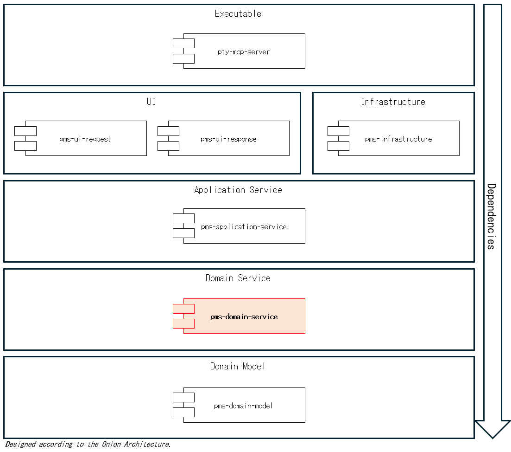

# pms-domain-service

`pms-domain-service` is one of the internal packages that make up the [`pty-mcp-server`](https://github.com/phoityne/pty-mcp-server) project.  
It defines the state-managed core application logic, serving as the foundation of the system’s behavior and lifecycle management.

This package models the application as an explicit state machine, where domain operations are defined in terms of transitions between well-typed states.  
To achieve this, it leverages Generalized Algebraic Data Types (GADTs) to encode state transitions and enforce correctness at the type level.

The design enables the domain to maintain strict control over valid operations, lifecycle invariants, and business rules.  
Though it follows the State Pattern in structure, the emphasis is on ensuring a predictable, evolvable, and verifiable control flow within the domain.

By isolating this logic from UI and infrastructure concerns, `pms-domain-service` functions as the core domain layer, managing the internal state of the application in a controlled and testable manner.

---

## Package Structure

---

## Module Structure

---
